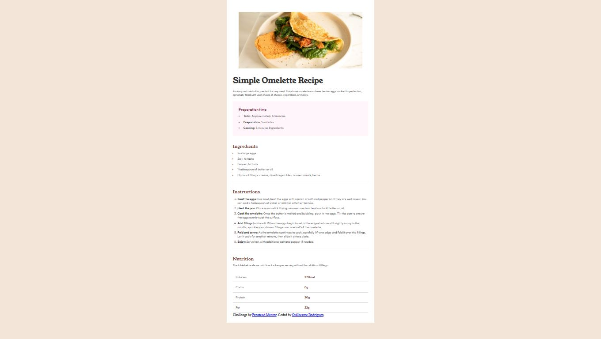

# Frontend Mentor - Recipe page solution

This is a solution to the [Recipe page challenge on Frontend Mentor](https://www.frontendmentor.io/challenges/recipe-page-KiTsR8QQKm). Frontend Mentor challenges help you improve your coding skills by building realistic projects. 

## Table of contents

- [Overview](#overview)
  - [Screenshot](#screenshot)
  - [Links](#links)
  - [Built with](#built-with)
- [Author](#author)

## Overview

### Screenshot

### Links

- Solution URL: [My Solution](https://www.frontendmentor.io/solutions/recipe-solution-HVlVgWLJho)
- Live Site URL: [Voce pode ver o projeto no seu browser clicando aqui/You can see the project in your own browser by clicking here](https://guilhermerodrigu3s.github.io/Frontend-Mentor---Recipe-page-solution/)

### Built with

- Semantic HTML5 markup
- CSS

## Author

- Frontend Mentor - [@guilhermerodrigu3s](https://www.frontendmentor.io/profile/guilhermerodrigu3s)
- Linkedin - [@guilhermerodrigues](https://www.linkedin.com/in/guilherme-rodrigues-silva-33705926a/)

